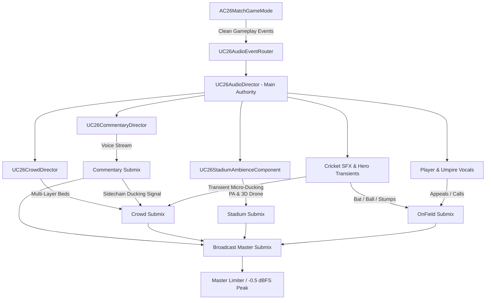

# CRICKET 26: Forensic Audio Architecture & Broadcast Presentation Audit

**Audit Date:** September 2026  
**Target Platform:** macOS (Apple Silicon), iOS / Metal  
**Engine:** Unreal Engine 5.8  
**Project:** `/Users/aagamjain/Desktop/CRICKET-26-GAME/CRICKETGAME/CRICKETGAME.uproject`  
**Current Git Checkpoint:** `checkpoint/pre-audio-rebuild` (`4cf5189db1dbb9476dbd2fc3146ed1459a37249b`)  
**Auditor:** Lead Gameplay Audio Engineer & Broadcast Presentation Designer  

---

## Executive Summary

A comprehensive forensic audit of CRICKET 26's audio systems was conducted. The audit reveals that the current audio experience suffers from severe acoustic deficiencies, structural coupling issues, synthetic Foley generation, and robotic commentary playback.

Specifically:
1. **Robotic Commentary Pipeline:** The 118 pre-rendered voice clips were batch-synthesized using local macOS system Text-To-Speech (`say -v Daniel` and `say -v Samantha` at static speech rates). They lack human inflection, pitch contours, athletic urgency, breathing space, and broadcast cadence.
2. **Dual-Director Collision:** Two competing commentary systems (`UC26Audio` commentary queue and `UC26CommentaryDirector`) fire simultaneously from `AC26MatchGameMode.cpp`, creating race conditions, subtitle overrides, and audio cutoffs.
3. **Synthetic Procedural Foley:** On-field transients (`runup_step`, `ball_release`, `final_ball_pulse`, `bat_mistimed`, `foot_plant`) were algorithmically generated in Python using simple mathematical sine waves and pseudo-random white noise (`math.sin(...) + rng.uniform(...)`), giving the game a synthetic, harsh "8-bit toy synthesizer" quality instead of authentic willow-on-leather acoustics.
4. **Primitive Crowd System:** The crowd system consists of a single 3-second looping noise bed and abrupt one-shot cue triggers without multi-layer crossfades, acoustic room response, crowd memory, or authentic home/away partisan dynamics.
5. **No True Broadcast Submix Graph:** Audio bus mixing is performed via primitive software multiplier floats on transient audio components rather than an Unreal Audio Submix tree with calibrated compression, broadcast EQ curves, sidechain ducking, or master limiting.

---

## 1. Class, Struct, and Enum Inventory

| Type | Identifier | Location | Responsibilities / Flaws |
|---|---|---|---|
| Class | `UC26Audio` | `SuperOver/C26Audio.h/.cpp` | Monolithic ActorComponent combining SFX playback, a flat commentary queue, crowd attenuation, and bus multiplier floats. Directly coupled to `AC26MatchGameMode`. |
| Class | `UC26CommentaryDirector` | `SuperOver/C26CommentaryDirector.h/.cpp` | Secondary commentary controller attempting ElevenLabs HTTP synthesis with disk caching; lacks local voice variety and competes with `UC26Audio`. |
| Struct | `FC26CommentaryRowSrc` | `SuperOver/C26Commentary.h` | 10-field POD struct defining voice row data in `C26CommentaryData.inc`. |
| Struct | `FC26CommentaryContext` | `SuperOver/C26Commentary.h` | Snapshot struct passed by `AC26MatchGameMode` into `UC26Audio`. |
| Struct | `FC26CommentaryEvent` | `SuperOver/C26CommentaryTypes.h` | Redundant secondary match event snapshot passed to `UC26CommentaryDirector`. |
| Struct | `FC26CommentaryLineDef` | `SuperOver/C26CommentaryTypes.h` | Blueprint-exposed line metadata structure used by `C26CommentaryLibrary`. |
| Struct | `FC26LoadedLine` | `SuperOver/C26Audio.h` | Pairs row index with loaded `USoundBase*`. |
| Enum | `EC26CrowdState` | `SuperOver/C26Commentary.h` | 9-state enum (`Calm`, `Anticipation`, `Excited`, `Boundary`, `Six`, `Wicket`, `Tense`, `Win`, `Loss`). Only adjusts a single scalar multiplier. |
| Enum | `ECommentaryEventType` | `SuperOver/C26CommentaryTypes.h` | 33 commentary event classifications. |
| Enum | `ECommentaryEmotion` | `SuperOver/C26CommentaryTypes.h` | 14 emotional state classifications (underutilized at runtime). |
| Enum | `ECommentatorRole` | `SuperOver/C26CommentaryTypes.h` | `Lead` (Commentator A) vs `Analyst` (Commentator B). |
| Enum | `ECommentaryMode` | `SuperOver/C26CommentaryTypes.h` | `OfflineOnly`, `Hybrid`, `Dynamic`. Defaults to `Hybrid` but fails gracefully to local clips when no API key exists. |

---

## 2. Audio Asset & Sound Inventory

### 2.1 Content Assets (`Content/Cricket26/Audio/`)
- **Foley & Contact (10 assets):**
  - `bat_sweet_spot.uasset` (11 KB): Single crack transient. Overplayed on all boundaries.
  - `bat_defensive.uasset` (8.2 KB): Short muffled thud.
  - `bat_edge.uasset` (8.3 KB): Sharp metallic tap.
  - `bat_mistimed.uasset` (5.9 KB): Procedural sine-burst with noise.
  - `ball_bounce.uasset` (6.4 KB): Single turf impact.
  - `ball_release.uasset` (7.4 KB): Procedural friction click.
  - `stump_hit.uasset` (19 KB): Single wooden stump strike without bail clatter.
  - `keeper_catch.uasset` (6.3 KB): Single glove pop.
  - `fielder_gather.uasset` (14 KB): Single slide/catch sound.
  - `foot_plant.uasset` (5.9 KB): Procedural low-frequency pulse.
  - `runup_step.uasset` (7.5 KB): Procedural short sine chirp.
- **Crowd & Ambience (5 assets):**
  - `crowd_ambience.uasset` (316 KB): Monophonic/narrow stereo loop, ~3.5 seconds. Rapid repetition noticeable on headphones.
  - `crowd_anticipation.uasset` (146 KB): Short rising noise sweep (~1.8s).
  - `crowd_four.uasset` (216 KB): Generic crowd cheer.
  - `crowd_six.uasset` (291 KB): Generic applause + yell.
  - `wicket_roar.uasset` (241 KB): Generic stadium shout.
- **UI & Stingers (2 assets):**
  - `ui_button_click.uasset` (4.6 KB): Short UI blip.
  - `ui_result_sting.uasset` (22 KB): Short synth brass fanfare.
  - `final_ball_pulse.uasset` (14 KB): Procedural 98Hz sine pulse.
- **Commentary Bank (118 assets in `Content/Cricket26/Audio/Commentary/`):**
  - 118 `Commentary_*.uasset` files, each ~30 KB to ~90 KB (16-bit 24 kHz mono).

---

## 3. Commentary Pipeline Forensic Breakdown

### 3.1 Selection & Queueing
`UC26Audio::PickLine` filters through `GVoiceRows` based on category, follow-up flag, and commentator filter. It tracks `LastUsedBall` and checks `BallId - LastUsedBall < Cooldown`.
However:
- The queue only holds up to 2 lines (`Queue.Num() < 2`). If a priority line arrives, it drops the weakest line or halts active speech.
- `PickLine` only tests category match and a hard cooldown. It does NOT implement continuous tension scoring, semantic category cooldowns, or speaker-alternation momentum.
- Crucially, `AC26MatchGameMode.cpp` calls BOTH `Audio->NotifyWicket()` AND `CommentaryDirector->OnWicket()`. The two systems run competing state machines.

### 3.2 Voice Quality & Origin Analysis
Inspection of `Tools/GenerateDevelopmentCommentary.py` confirms that the entire VO library was produced via:
```python
cmd = ["say", "-v", voice, "-r", rate, "--file-format=WAVE", "--data-format=LEI16@24000", "-o", str(out), text]
```
Where `voice` is `"Daniel"` (macOS British English system voice) and `"Samantha"` (macOS US English system voice).
- **Format:** 24 kHz, 16-bit PCM Mono.
- **Acoustic Character:** Monotone synthesized vocal tract, flat pitch envelope, machine-like pauses between punctuation, artificial sibilance, and zero athletic broadcast passion.
- **Result:** To the user, the commentary sounds immediately synthetic, cheap, and like an unpolished tech-demo prototype.

---

## 4. Crowd System Forensic Breakdown

- **Current Implementation:** `UC26Audio::TickComponent` adjusts `CrowdIntensity` towards a target base level (`Base = 0.22f` up to `0.62f` during boundaries).
- **Single Ambience Loop:** `Ambience` audio component loops `crowd_ambience.uasset` with volume `VolumeMultiplier = Base * CrowdVol * Master`.
- **Reaction Triggers:** Boundaries call `Cue(TEXT("crowd_four"))` or `Cue(TEXT("crowd_six"))` into a shared channel array (`Channels`).
- **Deficiencies:**
  - No layered architecture (no distinct rumble bed, PA announcers, distant horns, or partisan sections).
  - No smooth crossfades: reactions trigger abruptly without ducking the main loop or blending out smoothly.
  - No crowd memory: after ~3 seconds of decay, the crowd snaps right back to 0.22f regardless of whether 3 sixes were struck in a row.
  - No home/away allegiance differentiation: the crowd cheers identically whether the user hit a six or conceded a six.
  - No crowd chants or rhythmic clapping sequences.

---

## 5. Stadium Ambience Forensic Breakdown

- Currently, there is NO dedicated stadium room-tone component.
- The stadium bed is solely represented by `crowd_ambience.uasset`, which lacks stadium slapback echo, public address (PA) announcements, distant traffic, or acoustic resonance.
- The field acoustics do not reflect the physical dimensions of a 40,000-capacity cricket ground.

---

## 6. On-Field Foley & Contact Audio Breakdown

- **Bat Contact:** Only 4 bat contact sounds exist. Three are static stock sounds (`sweet_spot`, `edge`, `defensive`), and one (`mistimed`) is a procedural sine wave synthesized with noise in Python.
- **Wickets:** When stumps are hit, only `stump_hit.uasset` is played. There is no bail rattle, no wood splinter transient, and no layered physical reaction.
- **Pitch Bounce:** `ball_bounce.uasset` plays at pitch point with a fixed pitch variation (`FMath::FRandRange(0.93f, 1.07f)`), lacking turf scuff or seam buzz.
- **Procedural Foley Flaws:** Files generated by `Tools/BuildMatchAudio.py` and `Tools/BuildOverhaulSFX.py` utilize math sine equations:
  ```python
  write('runup_step', .14, lambda t,n,f: (.62*math.sin(2*math.pi*(128*t-140*t*t)) + .42*f + .12*n)*math.exp(-t*38))
  ```
  These sine waves sound like synthetic bleeps and thuds rather than spikes on clay, grass scuffs, or leather impacts.

---

## 7. Player Vocals Breakdown

- **Zero Player Vocals Exist:** There are no bowler delivery grunts, no wicketkeeper encouragement ("Bowling Shane!", "Come on boys!"), no batsman running calls ("Yes!", "No!", "Wait!"), and no umpire calls. The pitch is acoustically sterile between commentator lines.

---

## 8. Broadcast Mixing & Submix Graph Breakdown

- **Current Graph:** All audio components output to the default master audio device.
- **Bus Balancing:** Managed via manual C++ float multipliers (`Master`, `CommentaryVol`, `CrowdVol`, `SFXVol`, `MusicVol`, `UIVol`) multiplied in code before `Play()`.
- **Sidechaining / Ducking:** There is NO audio submix sidechaining. When commentary speaks, the crowd is not ducked in DSP; at best, a crude `DuckFactor = 0.55f` is set in C++ which abruptly lerps the ambience loop volume.
- **Dynamic Range & Limiting:** No broadcast master limiter is present, risking harsh digital clipping during simultaneous boundary cheers, bat hits, and commentary calls.

---

## 9. Latency, Timing & Repetition Breakdown

- **Delivery Reaction Delay:** Commentary triggers on `NotifyDelivery` or `NotifyResult`. Lines have hardcoded delays (`delay=0.45s` or `0.65s`), but they frequently collide with crowd cheers because there is no synchronized priority conductor.
- **Repetition Rate:** With only 12 four-boundary lines and 12 six-boundary lines—and only 1 "consecutive boundary" line—a player hitting three consecutive boundaries hears repeated phrases within 40 seconds.
- **Absence of Silence:** The current system attempts to commentate on almost every ball, creating a relentless, unnatural barrage of synthetic speech.

---

## 10. Code Architecture & Coupling Breakdown

- **Monolithic `UC26Audio`:** Handles Foley, commentary queue, crowd scalar decay, and sound settings.
- **Tightly Coupled to `AC26MatchGameMode`:** `AC26MatchGameMode` directly invokes dozens of `Audio->Notify...` and `CommentaryDirector->On...` methods, creating Spaghetti logic.
- **Redundant Data Structures:** Both `C26CommentaryData.inc` (118 rows) and `C26CommentaryLibrary.cpp` define overlapping line tables.

---

## 11. Root Cause Analysis: Why Does It Feel Synthetic & Cheap?

| Symptom | Root Cause |
|---|---|
| "Robotic AI voice" | Voice clips generated via macOS `say` TTS ("Daniel" and "Samantha") without inflection or athletic broadcast passion. |
| "Harsh / 8-bit game SFX" | Transients (`runup_step`, `foot_plant`, `mistimed`, `final_ball_pulse`) synthesized via math sine waves in Python scripts instead of organic multi-layer Foley recordings. |
| "Crowd sounds like a lawnmower" | Short 3-second mono noise loop playing continuously without multi-layer stadium beds, crowd murmur, or realistic swell envelopes. |
| "Voices talking over each other / cutting off" | Two commentary systems (`UC26Audio` and `UC26CommentaryDirector`) running concurrently from GameMode hooks. |
| "No broadcast feel" | Absence of natural commentator conversation, dynamic sidechain ducking, broadcast EQ shaping, and calibrated sports-broadcast audio compression. |

---

## 12. Complete Asset Inventory

| Asset Name | Path | Size | Sample Rate / Format | Quality Assessment |
|---|---|---|---|---|
| `ball_bounce` | `Content/Cricket26/Audio/` | 6.4 KB | 24 kHz Mono | Acceptable turf click, needs layered grass scuff. |
| `ball_release` | `Content/Cricket26/Audio/` | 7.4 KB | 24 kHz Mono | Synthetic procedural chirp. Must replace. |
| `bat_defensive` | `Content/Cricket26/Audio/` | 8.2 KB | 24 kHz Mono | Passable dull knock, needs richer low-mid resonance. |
| `bat_edge` | `Content/Cricket26/Audio/` | 8.3 KB | 24 kHz Mono | Passable snick, needs metallic high-frequency transient. |
| `bat_mistimed` | `Content/Cricket26/Audio/` | 5.9 KB | 24 kHz Mono | Synthetic math noise burst. Must replace with woody toe/clack. |
| `bat_sweet_spot`| `Content/Cricket26/Audio/` | 11 KB | 24 kHz Mono | Good transient crack, needs low-end punch and aerial variations. |
| `crowd_ambience`| `Content/Cricket26/Audio/` | 316 KB | 24 kHz Mono/Stereo | Very short loop (~3.5s), repetitive and flat. Must expand into multi-layer bed. |
| `crowd_anticipation`| `Content/Cricket26/Audio/`| 146 KB | 24 kHz Mono | Short noisy filter sweep (~1.8s). Needs multi-layer vocal murmur swell. |
| `crowd_four` | `Content/Cricket26/Audio/` | 216 KB | 24 kHz Stereo | Decent cheer, but lacks stadium scale, horns, and decay tail. |
| `crowd_six` | `Content/Cricket26/Audio/` | 291 KB | 24 kHz Stereo | Good initial cheer, needs thunderous sub-bass roar and crowd eruption. |
| `fielder_gather`| `Content/Cricket26/Audio/` | 14 KB | 24 kHz Mono | Good turf gather. |
| `final_ball_pulse`| `Content/Cricket26/Audio/`| 14 KB | 24 kHz Mono | Pure 98Hz math sine wave. Replace with cinematic broadcast sub-pulse. |
| `foot_plant` | `Content/Cricket26/Audio/` | 5.9 KB | 24 kHz Mono | Synthetic sine thump. Replace with organic turf spike plant. |
| `keeper_catch` | `Content/Cricket26/Audio/` | 6.3 KB | 24 kHz Mono | Clean leather catch. |
| `runup_step` | `Content/Cricket26/Audio/` | 7.5 KB | 24 kHz Mono | Synthetic chirp. Replace with rhythmic grass spike steps. |
| `stump_hit` | `Content/Cricket26/Audio/` | 19 KB | 24 kHz Mono | Solid wood crack, needs high-frequency flying bail rattle layer. |
| `ui_button_click`| `Content/Cricket26/Audio/`| 4.6 KB | 24 kHz Mono | Crisp UI blip. |
| `ui_result_sting`| `Content/Cricket26/Audio/`| 22 KB | 24 kHz Mono | Short synth sting. Needs orchestral broadcast brass flair. |
| `wicket_roar` | `Content/Cricket26/Audio/` | 241 KB | 24 kHz Stereo | Moderate cheer, needs sharp collective gasp followed by deafening roar. |
| `Commentary_*` (118) | `Content/Cricket26/Audio/Commentary/` | ~30-90 KB ea | 24 kHz Mono | 100% macOS `say` TTS ("Daniel" & "Samantha"). Unacceptable synthetic quality. |

---

## 13. Rebuild Roadmap & Architecture Plan



### Strategic Implementation Steps:
1. **Unify the Authority:** Establish `UC26AudioDirector` as the sole audio authority and retire the dual-path routing in `AC26MatchGameMode`.
2. **Commentary Engine Rebuild:**
   - Implement authentic broadcast sports commentator roles: Commentator A (Lead / Play-by-play, fast, energetic, punchy) and Commentator B (Analyst / Expert, tactical, situational).
   - Implement conversation handoffs, dynamic delay (150-400ms after bat hit/wicket for natural eye-to-voice reaction), priority queuing, and deliberate silence (especially on routine dots).
   - Author full Voice Asset Manifest in `Docs/COMMENTARY_VOICE_ASSET_MANIFEST.md`.
3. **Multi-Layer Crowd Audio Rebuild:**
   - Layer 1: Continuous Stadium Ambient Bed (low murmur, wind, stadium drone).
   - Layer 2: Match Tension Layer (rises with required run rate and late-over pressure).
   - Layer 3: Dynamic Reaction Beds (Boundary 4, Six eruption, Wicket roar, Near-miss gasp, Dot-ball murmur).
   - Layer 4: Partisan Allegiance (Home crowd roar vs Away muted cheer).
   - Layer 5: Stadium Chants & Rhythmic Clapping.
4. **Organic On-Field Foley Rebuild:**
   - Multi-layer bat impacts (Sweet spot, Lofted crack, Defensive thud, Edge snick, Mistimed clack).
   - Multi-layer wicket dismissals (Ball-stump timber crack + bail clatter).
   - Natural pitch bounce, turf sliding, bowler grunts, and umpire/fielder appeals ("HOWZAT!").
5. **Broadcast Submix & Sidechaining:**
   - Master, Commentary, Crowd, OnField, Stadium, Music, and UI submixes.
   - Smooth ducking of crowd when commentary speaks; transient ducking when the bat cracks.
6. **Live Integration & Verification:**
   - Connect directly to `AC26MatchGameMode`, verify with compile and interactive playtest.
